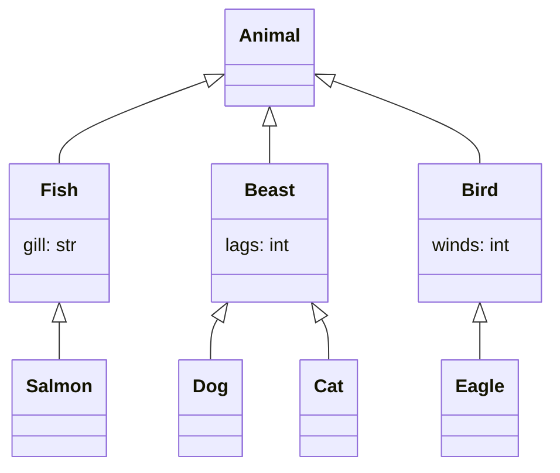

```mermaid
classDiagram
    class Animal {
    }

    class Fish {
        gill: str
    }

    class Beast {
        lags: int
    }

    class Bird {
        winds: int
    }

    class Dog {
    }

    class Cat {
    }

    class Salmon {
    }

    class Eagle {
    }


    Animal <|-- Fish
    Animal <|-- Beast
    Animal <|-- Bird
    Beast <|-- Dog
    Beast <|-- Cat
    Fish <|-- Salmon
    Bird <|-- Eagle
```