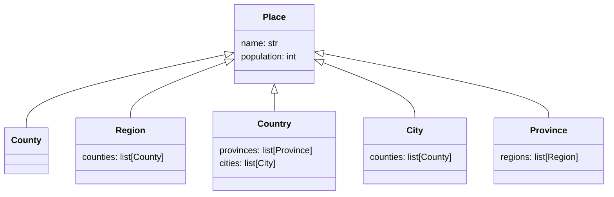

```mermaid
classDiagram
    class Place {
        name: str
        population: int
    }

    class County {
    }

    class Region {
        counties: list[County]
    }

    class Province {
        regions: list[Region]
    }

    class City {
        counties: list[County]
    }

    class Country {
        provinces: list[Province]
        cities: list[City]
    }


    Place <|-- County
    Place <|-- Region
    Place <|-- Country
    Place <|-- City
    Place <|-- Province
```