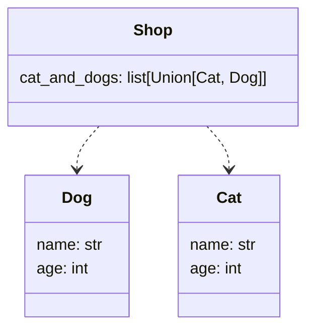

```mermaid
classDiagram
    class Cat {
        name: str
        age: int
    }

    class Dog {
        name: str
        age: int
    }

    class Shop {
        cat_and_dogs: list[Union[Cat, Dog]]
    }


    Shop ..> Dog
    Shop ..> Cat

```