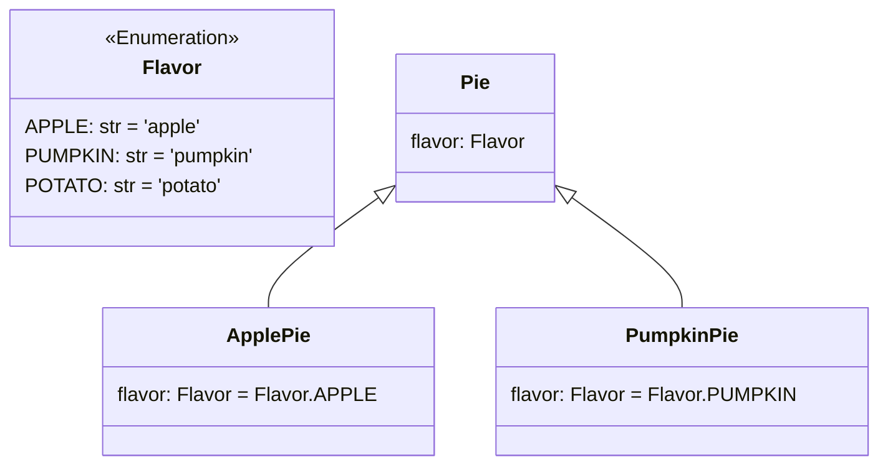

```mermaid
classDiagram

    class Flavor {
        <<Enumeration>>
        APPLE: str = 'apple'
        PUMPKIN: str = 'pumpkin'
        POTATO: str = 'potato'
    }

    class Pie {
        flavor: Flavor
    }

    class ApplePie {
        flavor: Flavor = Flavor.APPLE
    }

    class PumpkinPie {
        flavor: Flavor = Flavor.PUMPKIN
    }


    Pie <|-- ApplePie
    Pie <|-- PumpkinPie

```