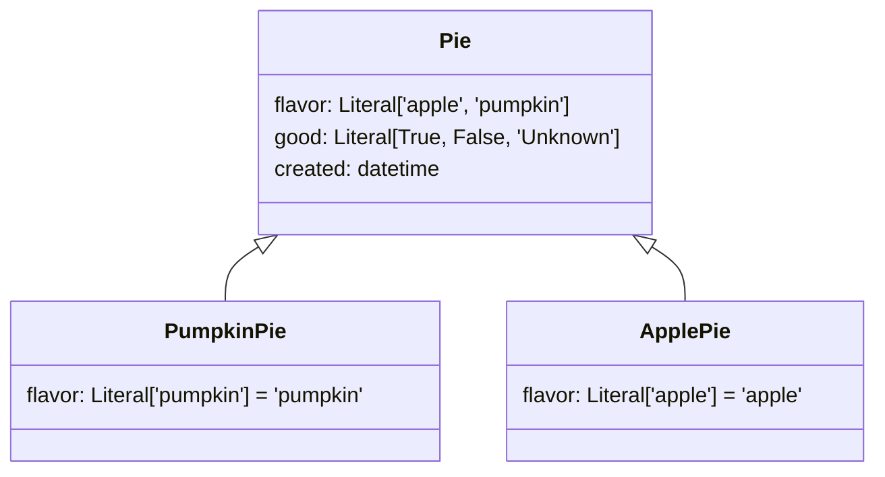

```mermaid
classDiagram

    class Pie {
        flavor: Literal['apple', 'pumpkin']
        good: Literal[True, False, 'Unknown']
        created: datetime
    }

    class ApplePie {
        flavor: Literal['apple'] = 'apple'
    }

    class PumpkinPie {
        flavor: Literal['pumpkin'] = 'pumpkin'
    }


    Pie <|-- PumpkinPie
    Pie <|-- ApplePie

```