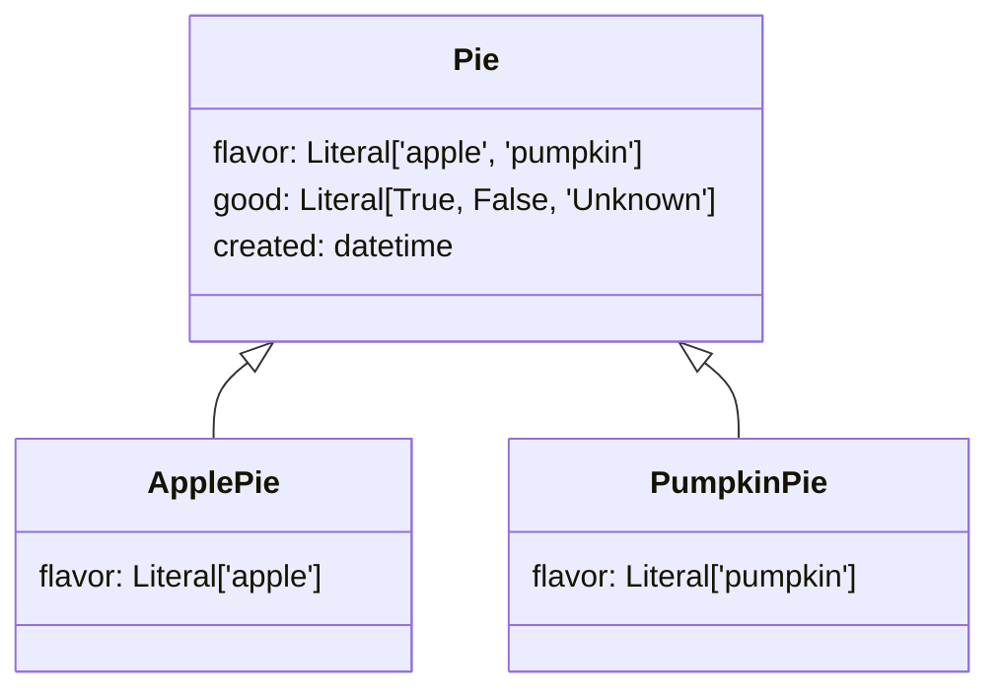

```mermaid
classDiagram
    class Pie {
        flavor: Literal['apple', 'pumpkin']
        good: Literal[True, False, 'Unknown']
        created: datetime
    }

    class ApplePie {
        flavor: Literal['apple']
    }

    class PumpkinPie {
        flavor: Literal['pumpkin']
    }


    Pie <|-- ApplePie
    Pie <|-- PumpkinPie
```