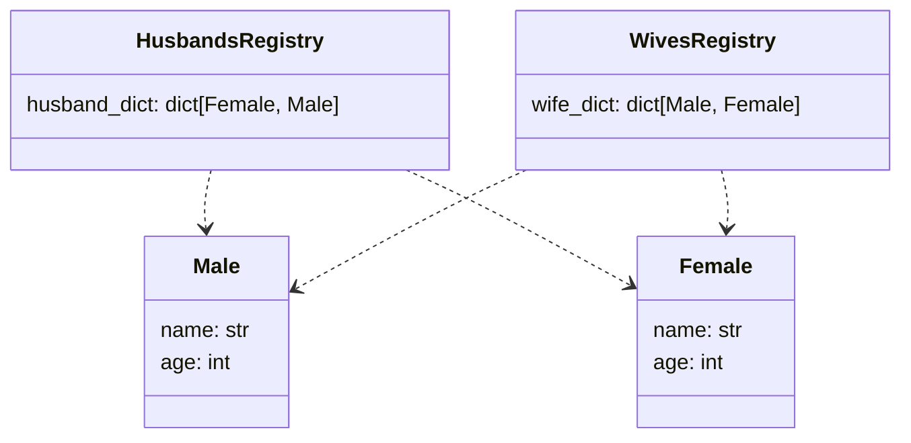

```mermaid
classDiagram
    class Male {
        name: str
        age: int
    }

    class Female {
        name: str
        age: int
    }

    class HusbandsRegistry {
        husband_dict: dict[Female, Male]
    }

    class WivesRegistry {
        wife_dict: dict[Male, Female]
    }


    HusbandsRegistry ..> Male
    HusbandsRegistry ..> Female
    WivesRegistry ..> Male
    WivesRegistry ..> Female

```