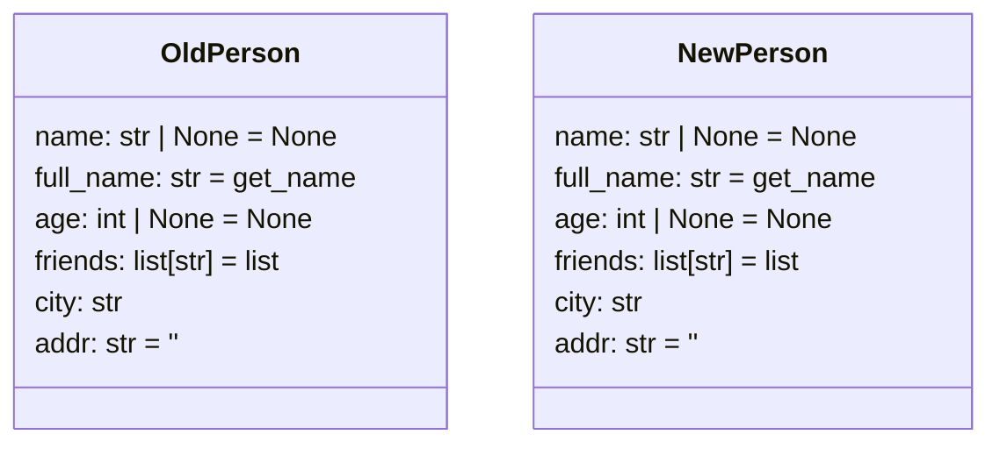

```mermaid
classDiagram

    class OldPerson {
        name: str | None = None
        full_name: str = get_name
        age: int | None = None
        friends: list[str] = list
        city: str
        addr: str = ''
    }

    class NewPerson {
        name: str | None = None
        full_name: str = get_name
        age: int | None = None
        friends: list[str] = list
        city: str
        addr: str = ''
    }


```