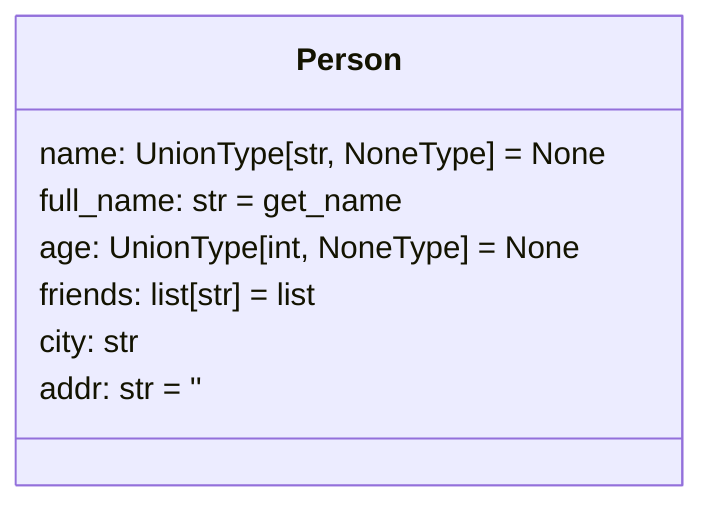

```mermaid
classDiagram

    class Person {
        name: UnionType[str, NoneType] = None
        full_name: str = get_name
        age: UnionType[int, NoneType] = None
        friends: list[str] = list
        city: str
        addr: str = ''
    }


```