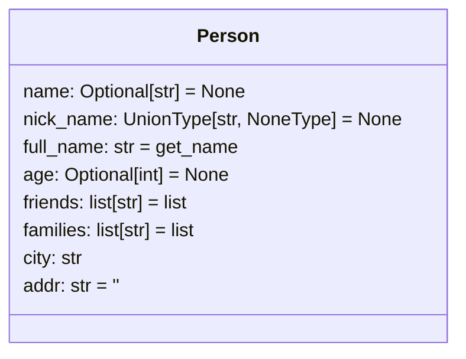

```mermaid
classDiagram

    class Person {
        name: Optional[str] = None
        nick_name: UnionType[str, NoneType] = None
        full_name: str = get_name
        age: Optional[int] = None
        friends: list[str] = list
        families: list[str] = list
        city: str
        addr: str = ''
    }


```